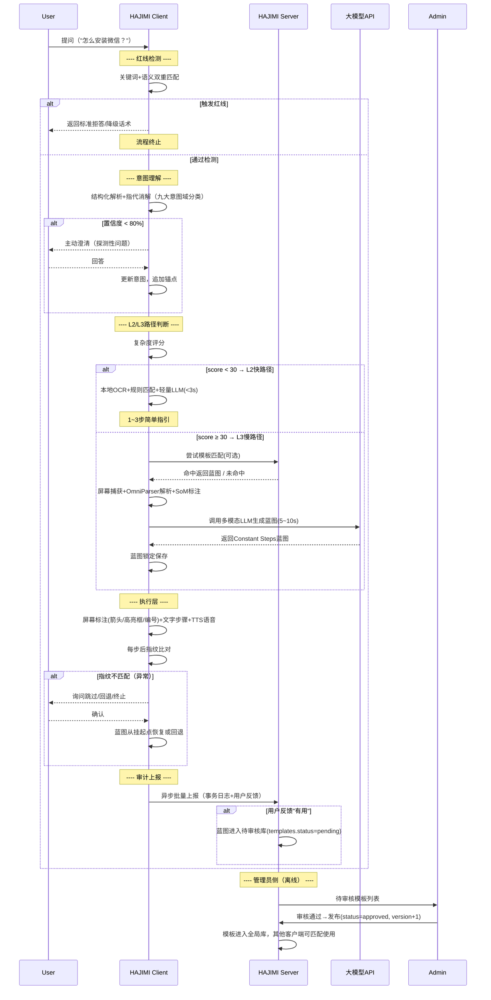

# HAJIMI — 智能桌面指引助手 完整设计文档V2

> **HAJIMI** = **H**elper **A**gent **J**ourney **I**ntelligent **M**emory **I**nteraction
>
> 日语中意为"初次/开始"——从这里开始，让复杂的电脑操作变得简单。

> **更新说明（V1→V2）**：
> - 速度策略由三级（L1/L2/L3）调整为二级（L2/L3），模板匹配改为服务端辅助查询接口
> - 数据库由 5 张表扩展为 7 张表（新增 t_users、t_system_configs）
> - UI布局细化为"左侧按钮列 + 主面板 + 右侧详情面板"三栏布局
> - 团队分工调整：语音交互（ASR/TTS）由 B 移交至 C
> - 新增E-R实体设计、算法设计、系统性能要求等章节
> - 对齐《HAJIMI_概要设计文档_V3.7》与《需求说明书_v2.5》


## 一、项目主题与定位

**项目名称**：HAJIMI — 智能桌面指引助手

**核心定位**：面向所有电脑用户（尤其新手、老年用户、视障用户）的桌面辅助程序。用户通过自然语言（文本/语音）提问，系统理解屏幕内容与用户意图后，给出清晰、安全、分步的操作指引，通过**屏幕标注（箭头/高亮/编号）、文字步骤、语音播报**三种方式同步输出，**仅提供指引，不直接操控电脑**。

**核心价值**：
- 降低电脑操作门槛，解决"不知道点哪里""找不到功能"的困惑
- 提供实时、上下文感知的交互式帮助，无需切换窗口查教程
- 通过主动澄清机制确保准确理解用户需求
- 通过任务蓝图机制保证复杂操作的连续性与可靠性
- **C-S协同进化**：所有用户的操作经验可沉淀为模板，惠及后续用户

**核心意图域覆盖**（九大意图域 × 五种指代方式 × 六种交互模式）：
- **九大意图域**：操作执行指引、界面元素认知、异常诊断与恢复、界面导航与定位、内容认知与信息处理、桌面环境与资产管理、状态监控与主动预警、流程复盘与教学记忆、情感陪伴与语境缓解
- **五种指代方式**：显式命名、视觉位置、指示代词、模糊/口语化描述、上下文接力指代
- **六种交互模式**：原子指令、线性多步流程、跨应用切换流程、抽象非屏任务、被动触发模式、主动澄清模式
- **三条安全红线**：不替用户操作（物理操作红线）、不碰隐私内容（个人隐私红线）、不跟踪动态画面（实时动态红线）


## 二、项目背景

### 2.1 现实痛点
- 电脑功能繁杂，新手用户常因界面复杂、图标含义不明、术语陌生而卡在基础操作上。
- 现有帮助文档（F1帮助、在线教程）是静态的、脱离上下文的，用户需要在"问题窗口"和"教程窗口"间反复切换，认知负担重。
- 视障及老年用户依赖屏幕朗读器，但朗读器仅能提取文字，无法理解图形界面的布局、图标语义和操作路径。
- 操作过程中的小偏差（点错按钮、多点了两步）往往导致任务失败，用户不知如何回退或纠正。
- 目前缺乏一套"越用越聪明"的桌面辅助系统——用户成功经验无法沉淀复用。

### 2.2 技术成熟度
- **多模态大模型**（GPT-4V、Qwen-VL、Claude 3.5 Sonnet）能够同时理解图像与文本，具备强大的视觉推理能力。
- **开源UI解析工具**（OmniParser V2、PaddleOCR+GroundingDINO）可精准提取屏幕上的可交互元素及其位置。
- **桌面GUI框架**（PyQt5）成熟稳定，支持透明覆盖层绘制，可实现屏幕标注。
- **语音交互**（ASR/TTS）已高度普及，离线方案（Vosk/pyttsx3）和云端方案（Google/百度/Azure API）均可用。
- **Web前后端技术**（FastAPI、Vue3+Element-Plus）成熟，可快速构建管理员控制台。

### 2.3 项目意义
- 为计算机教育、无障碍辅助、企业培训、家庭技术支持提供新型交互工具。
- 填补"实时屏幕上下文 + 自然语言交互 + 群体知识沉淀"的桌面辅助空白。
- 技术综合性强（GUI开发、图像处理、AI推理、语音交互、前后端分离、数据库设计），适合作为实训项目。


## 三、建设目标

1. **智能感知**：实时捕获用户屏幕，精准识别所有可交互元素（按钮、输入框、图标、菜单等），准确率≥90%。
2. **准确理解**：通过语义解析、指代消解、主动澄清三层机制，确保正确理解用户真实需求，意图分类准确率≥85%。
3. **稳定规划**：对复杂任务生成"任务蓝图"（恒定步骤序列），在执行过程中抵抗用户误操作和环境突变。
4. **多模态输出**：通过屏幕标注（箭头/高亮/编号）、文字步骤列表、语音播报三种方式同步反馈。
5. **二级速度保障**：快路径 L2（<3秒）→ 慢路径 L3（5~10秒），根据任务复杂度自动选择最优路径。
6. **群体进化**：所有客户端的成功经验可沉淀为服务端模板库，实现"一次学会，全域共享"。
7. **安全可控**：仅提供指引，不自动执行高风险操作；隐私数据脱敏后上报，原始截图不上传；严格遵守三条安全红线。


## 四、系统架构（四层 + C-S 拆分）

系统分为**客户端（HAJIMI Client）**和**服务端（HAJIMI Server）**。

- **客户端**：面向终端用户，负责实时交互、屏幕感知、本地推理与执行反馈，保证低延迟。
- **服务端**：面向管理员，负责数据持久化、跨客户端日志聚合、模板审核与匹配、配置下发、系统健康监控。


### 4.1 整体架构图（文字描述）

```
┌─────────────────────────────────────────────────────────────────────────────┐
│                          HAJIMI Server（服务端）                           │
│  ┌─────────────────┐  ┌─────────────────┐  ┌─────────────────────────────┐ │
│  │   数据库持久化   │  │   管理员控制台   │  │   模板匹配 & 配置中心       │ │
│  │   （7张核心表）  │  │   （Vue3 Web）   │  │  （关键词匹配/热部署）      │ │
│  └────────┬────────┘  └────────┬────────┘  └────────────┬────────────────┘ │
│           │                    │                        │                  │
│           └────────────────────┼────────────────────────┘                  │
│                                │ RESTful API / WebSocket                   │
└────────────────────────────────┼────────────────────────────────────────────┘
                                 │ HTTPS/WSS
┌────────────────────────────────┼────────────────────────────────────────────┐
│                                ▼                                           │
│  ┌─────────────────────────────────────────────────────────────────────────┐│
│  │                    HAJIMI Client（桌面端，多实例）                       ││
│  │  ┌──────────────┐  ┌──────────────────┐  ┌──────────┐  ┌─────────────┐││
│  │  │   感知层     │  │  理解与规划层    │  │  执行层  │  │  审计代理   │││
│  │  │（CAP/PARSER/ │  │ （INTENT/PLANNER │  │（ANNO/   │  │（本地缓存/  │││
│  │  │  SOM/REDLINE)│  │  /MEMORY）       │  │ TEXT/TTS)│  │  异步上报） │││
│  │  └──────────────┘  └──────────────────┘  └──────────┘  └─────────────┘││
│  └─────────────────────────────────────────────────────────────────────────┘│
└─────────────────────────────────────────────────────────────────────────────┘
```


### 4.2 客户端：感知层（Perception Layer）

**职责**：将屏幕截图转化为结构化的UI元素数据，并进行红线安全检测。

#### 子模块：

**4.2.1 屏幕捕获（CAP）**
- 技术：`mss` 或 `PIL.ImageGrab`
- 功能：捕获全屏或当前活动窗口，适配高DPI缩放（`SetProcessDpiAwareness`）
- 触发时机：用户提问时立即捕获；后续步骤若窗口指纹未变则复用

**4.2.2 UI解析器（PARSER）**
- 首选方案：集成 **OmniParser V2**（开源），直接输出元素边界框、类型（button/input/icon/menu/checkbox/dropdown等）、文本内容、置信度
- 备选方案（资源受限）：`PaddleOCR`（文字检测+识别）+ `GroundingDINO`（目标检测），通过后处理合并为统一元素列表
- 输出：元素列表 `[{id, bbox:[x1,y1,x2,y2], type, text, confidence}, ...]`
- **缓存优化**：若窗口指纹（SHA256(WindowHandle+Title+Top5_Element_Types)）未变，复用上一轮解析结果

**4.2.3 SoM标记生成器（SOM）**
- 在截图上为每个检测到的元素绘制彩色边界框（不同元素类型不同颜色：按钮蓝/输入框绿/图标黄）和唯一数字ID（~1, ~2, ...）
- 输出：
  - **标注图**（PIL Image→Base64，用于LLM视觉输入）
  - **元素映射表**：`{id: {bbox, type, text, center_coord}}`

**4.2.4 红线检测模块（REDLINE）**
- 在用户输入进入意图理解前，进行关键词+语义双重匹配
- 拦截三类违规请求（物理操作/个人隐私/实时动态），返回标准话术并终止流程
- 通过检测后，进入意图理解阶段


### 4.3 客户端：理解与规划层（Understanding & Planning Layer）

**这是系统的"大脑"，包含四个核心子模块。**

#### 4.3.1 意图理解模块（INTENT）

**职责**：确保"准确理解用户需求"，三层消歧机制。

**(1) 结构化解析**
- 使用 `jieba` 词性标注，剥离情绪词、冗余词
- 提取**核心目标**（动词+名词，如"安装微信"）和**约束条件**（如"不要装在C盘"）
- 基于 BERT-base-chinese 分类器归入**九大意图域**之一（准确率≥85%）

**(2) 指代消解与屏幕锚定**
- 支持五种指代方式：
  - **显式命名**："点击'确定'按钮" → OCR文本匹配
  - **视觉位置**："左上角那个蓝色的按钮" → bbox空间推理
  - **指示代词**："点这个""选那个" → 鼠标悬停坐标映射（若皆无则触发主动澄清）
  - **模糊/口语化描述**："那个圆圆的像齿轮的东西" → 多模态LLM语义匹配，返回Top3候选
  - **上下文接力指代**：上句结果自动映射为当前指代对象

**(3) 置信度检测与主动澄清**
- 综合置信度 = 分类概率×0.4 + 匹配确定性×0.4 + 上下文一致性×0.2
- 当置信度 < 80% 时，生成二选一/多选一的探测性问题
- 示例：用户问"怎么保存"，系统反问："您是想保存当前打开的Word文档，还是想下载网页上的这个文件？"
- 用户的澄清回答作为**新的事实锚点**，追加到轨迹层

#### 4.3.2 任务规划与蓝图管理模块（PLANNER）

**职责**：将用户需求转化为可执行的操作序列，复杂任务建立蓝图保护机制。

**二级速度保障（路由算法）**：

| 优先级 | 路径 | 触发条件 | 响应时间 | 说明 |
|--------|------|----------|----------|------|
| **L2（快）** | 快路径 | 复杂度评分 < 30（简单指令） | <3秒 | 本地OCR+规则匹配+轻量级LLM（Qwen2-VL-2B） |
| **L3（标准）** | 慢路径 | 复杂度评分 ≥ 30（复杂任务） | 5~10秒 | 完整流程：OmniParser+SoM+多模态LLM（GPT-4V/Qwen-VL-Max） |

- **复杂度评分**：规则评分 = 问题长度因子 + 动词数量因子 + 跨应用关键词加权。初期采用规则评分，预留 `ComplexityRouter` 接口支持后续替换为 BERT 分类器。
- **模板匹配**（服务端辅助）：客户端调用 `POST /api/templates/match`，服务端通过关键词哈希+余弦相似度（≥0.90）匹配预置蓝图，<100ms 返回。命中模板可加速 L3 流程，但不作为独立速度层级。

**蓝图生成与执行（L3专属）**：

1. **首轮生成**：构建多模态Prompt（SoM标注图+用户问题+意图域上下文+约束条件），调用LLM生成高层级主干步骤序列（Constant Steps），即"任务蓝图"
2. **锁定保存**：蓝图被保存在本地轨迹层，**后续所有子步骤基于此蓝图展开**
3. **状态机监控**：
   - 状态：`GENERATED` → `PENDING_CONFIRM` → `EXECUTING` → `SUSPENDED` → `ROLLING_BACK` → `COMPLETED/TERMINATED`
   - 每一步执行后，系统比对**当前屏幕指纹**与**蓝图预期的下一阶段指纹**
   - 关键字段匹配率 ≥ 80% → 推进蓝图
   - 匹配率 < 80% → 蓝图进入"挂起"状态
4. **挂起与恢复**：
   - 系统主动向用户确认："检测到屏幕状态与预期不符，您是跳过此步，还是退回蓝图第X步重试？"
   - 用户确认后，蓝图从挂起点恢复

**屏幕指纹构成**：`SHA256(WindowHandle + Title_Category + Top5_Element_Types + Foreground_Process)`，生成<50ms，存储开销<100B/条。

#### 4.3.3 上下文记忆模块（MEMORY）

**职责**：管理多轮对话历史，防止上下文溢出，保存蓝图状态。

- **短期记忆**：保留最近3轮完整对话（滑动窗口FIFO）
- **蓝图记忆**：当前任务完整蓝图及执行进度（step_ptr），独立保存不受对话历史影响
- **长期摘要**：Token超阈值（8k）时，LLM生成摘要替换旧历史
- **回退锚点**：蓝图各阶段的前置指纹哈希+步骤快照，供回退恢复


### 4.4 客户端：执行层（Execution Layer）

**职责**：将规划层输出的步骤转化为用户可感知的多模态反馈。

#### 4.4.1 屏幕标注渲染器（ANNO）
- 根据LLM输出的 `element_id`，查询映射表获取坐标
- 使用 **PyQt5透明覆盖层**（全屏、`WA_TransparentForMouseEvents` 鼠标事件穿透）绘制：
  - **红色箭头**：`QPainterPath` 绘制，#FF0000，线宽3px，从屏幕边缘指向目标元素
  - **红色虚线高亮框**：`QPen DashLine`，#FF0000，线宽2px，四角缺口12px，包围目标元素（外扩4px）
  - **SoM编号标签**：白底红字圆角矩形44×44px，文字"~N"（16pt Bold），放在目标元素正上方
- 仅在操作指引类意图时显示，内容认知模式（摘要、翻译等）自动隐藏

#### 4.4.2 文字指引显示（TEXT）
- 在桌面挂件的对话区显示结构化步骤列表
- 格式：`步骤N: 动作描述 + 目标元素引用(~id)`
- 当前步骤：黄色背景高亮(#FFF9C4)+左侧橙色色条(#FF9800, 3px)
- 已完成步骤：灰色文字(#9E9E9E)+绿色勾号(#4CAF50)
- 未执行步骤：半透明(opacity 0.4)

#### 4.4.3 语音合成输出（TTS）
- 离线引擎：`pyttsx3`（Windows SAPI5）
- 云端引擎：Azure TTS / 百度TTS
- 语速范围0.5-1.5倍（QSlider调节），默认慢速0.85倍
- 用户可开关、调节语速，播报时喇叭图标声波动画
- 播报与文字步骤同步触发，支持跳过/暂停/继续


### 4.5 客户端：审计代理（Audit Agent）

**职责**：本地缓存事务数据，异步上报至服务端，不影响实时交互。

- **拦截字段**：事务ID、时间戳、用户意图摘要（脱敏）、意图分类、指代方式、步骤生成方式（L2/L3）、执行结果、异常类型、用户反馈（有用/无用/中性）
- **隐私保护**：
  - 不上传原始截图、个人文件名
  - 窗口标题仅保留类别（正则替换，如"Word文档"）
  - 文件路径仅保留扩展名
  - 密码类输入自动替换为 `[REDACTED]`
- **上报策略**：先写本地SQLite缓存（WAL模式），累积10条或最后上报超过5分钟时批量POST；失败指数退避重试（1min/5min/15min/1h），超过3次写本地fallback日志文件


### 4.6 服务端：审计与优化层（Audit & Optimization Server）

#### 4.6.1 数据库设计（7张核心表）

| 表名 | 核心字段 | 用途 |
|------|----------|------|
| `t_users` | user_id(PK), username, password_hash(bcrypt), role(enum:user/admin), preferences(JSONB), created_at, last_login_at | 用户（含管理员）账户与偏好 |
| `t_transactions` | task_id(PK), user_id(FK), timestamp, intent_category, user_query, intent_summary, reference_type, plan_type(enum:L2/L3), blueprint_json(JSONB), result, duration_ms, clarification_count | 事务主表 |
| `t_step_logs` | log_id(PK), task_id(FK), step_index, action, target_element_id, target_bbox, status, fingerprint_before, fingerprint_after, fingerprint_match, error_code | 步骤明细 |
| `t_templates` | template_id(PK), name, constant_steps_json(JSONB), trigger_keywords, intent_category, source_task_id(FK), source_user_id(FK), status(enum:pending/approved/rejected/archived), reviewer_id(FK), version, use_count, useful_rate | 任务模板库 |
| `t_feedback` | feedback_id(PK), task_id(FK), user_id(FK), feedback_type(enum:useful/useless/neutral), comment, created_at | 用户反馈 |
| `t_failures` | failure_id(PK), task_id(FK), failure_type, step_index, fingerprint_hash, llm_snapshot(TEXT), error_detail, created_at | 异常明细 |
| `t_system_configs` | config_id(PK), config_key(UNIQUE), config_value(JSON), description, updated_by(FK), updated_at | 系统配置（热部署） |

- **ORM框架**：SQLAlchemy 2.0，主键统一UUID字符串（VARCHAR(64)）
- **双引擎支持**：SQLite 3（开发/客户端本地缓存）+ PostgreSQL 14+（生产）
- **迁移管理**：Alembic，所有DDL变更通过migration脚本管理

#### 4.6.2 管理员角色与功能（Web控制台）

**管理员定位**：不是"监控者"，而是**"系统调参师"和"知识配方师"**。

| 功能模块 | 管理员操作 | 对客户端影响 |
|---------|-----------|-------------|
| **仪表盘首页** | 查看核心指标卡片（事务量/在线客户端数/有用率/API费用）+ 饼图/折线图/柱状图 | 掌握系统整体运行态势 |
| **失败归因看板** | 查看高频失败任务TOP10，点击查看LLM推理快照和屏幕指纹对比 | 据此修改提示词或调整阈值 |
| **模板审核与发布** | 查看客户端上报的新蓝图（用户标记"有用"），审核后一键发布/下架，支持编辑关键词和版本控制 | 其他客户端可匹配使用，加速L3流程 |
| **配置热部署** | 修改置信度阈值、L2/L3路由规则、LLM端点、模型名称等9项参数 | 客户端定期拉取（`GET /api/config/pull`），无需重启 |
| **系统健康监控** | 查看在线客户端数、平均响应时长、L2/L3比例、API费用估算 | 辅助成本与性能评估 |
| **数据脱敏导出** | 导出脱敏日志用于离线分析 | 辅助项目报告 |

#### 4.6.3 C-S通信接口（RESTful API）

| 接口 | Method | 方向 | 用途 | 性能要求 |
|------|--------|------|------|----------|
| `/api/templates/match` | POST | C→S | 关键词匹配预置模板（余弦相似度≥0.90） | <100ms |
| `/api/templates/list` | GET | C→S | 获取模板列表（管理界面） | <200ms |
| `/api/audit/report` | POST | C→S | 批量上报审计日志 | <200ms |
| `/api/config/pull` | GET | C→S | 拉取最新系统配置（增量/全量） | <50ms |
| `/api/admin/stats` | GET | S→C | 管理员查看统计数据 | <500ms |

- **安全机制**：全链路HTTPS/WSS + JWT认证（Access Token 2h + Refresh Token 7d）+ HMAC-SHA256请求签名 + 时间戳时效验证（±5min）
- **框架**：FastAPI（异步）+ 自动生成OpenAPI 3.0文档 + Loguru结构化JSON日志


## 五、核心工作流程（完整时序）




## 六、关键技术要点

### 6.1 二级速度保障机制（L2-L3路由算法）

| 优先级 | 路径 | 触发条件 | 技术手段 | 响应时间 |
|--------|------|----------|----------|----------|
| L2 | 快路径 | 复杂度评分 < 30 | 本地OCR + 规则匹配 + 轻量LLM（Qwen2-VL-2B） | <3秒 |
| L3 | 慢路径 | 复杂度评分 ≥ 30 | 屏幕捕获 + OmniParser V2 + SoM标注 + 多模态LLM（GPT-4V/Qwen-VL-Max） | 5~10秒 |

- **模板匹配**（服务端辅助，<100ms）：不单独作为速度层级，而是加速L3流程的手段。客户端调用 `POST /api/templates/match`，命中预置蓝图则跳过LLM生成步骤。
- **复杂度评分** = 规则打分（问题长度 + 动词数量 + 跨应用关键词），预留 `ComplexityRouter` 接口支持后续升级为 BERT 分类器。

### 6.2 准确理解用户需求（三重保障）

- **结构化解析**：jieba词性标注 + 剥离情绪词 → 提取核心目标（动词+名词）+ 约束条件 → BERT分类器归入九大意图域（≥85%准确率）
- **指代消解**：五种方式（显式命名/视觉位置/指示代词/模糊描述/上下文接力）→ 统一消解为SoM元素ID，输出Top3候选+匹配置信度
- **主动澄清**：综合置信度（分类概率×0.4 + 匹配确定性×0.4 + 上下文一致性×0.2）< 80%时，生成二选一探测性问题

### 6.3 复杂任务蓝图保护机制

- **首轮规划**：构建多模态Prompt（SoM标注图+用户问题+意图域上下文+约束+历史摘要）→ LLM生成Constant Steps → 锁定保存
- **状态机监控**：7种状态（GENERATED→PENDING_CONFIRM→EXECUTING→SUSPENDED→ROLLING_BACK→COMPLETED/TERMINATED）→ 每步验证屏幕指纹匹配率 ≥ 80%
- **挂起与恢复**：指纹不匹配时暂停，澄清后恢复，蓝图不被破坏
- **回退支持**：用户可主动退回蓝图任意已执行步骤

### 6.4 SoM标记法（坐标定位）

- 解析器检测元素并分配ID → 生成带彩色ID标注图（SoM）→ LLM输出引用元素ID（如"点击标签~3的按钮"）→ 查表得坐标 → 传递给ANNO渲染
- **核心价值**：将LLM不擅长的"输出像素坐标"（准确率~40%）转化为擅长的"选择编号"（准确率~95%）

### 6.5 C-S协同进化

- **上报**：客户端执行完成后，将用户反馈"有用"的蓝图上报服务端
- **审核**：管理员在Web控制台查看、审核、发布（pending→approved，version+1）
- **分发**：其他客户端通过模板匹配接口获取，"一次学会，全域共享"

### 6.6 上下文管理（防止溢出）

- 滑动窗口（最近3轮完整对话，FIFO）
- 摘要压缩（Token超8k阈值时LLM生成压缩摘要替换旧历史）
- 蓝图状态独立保存（不受对话历史影响，step_ptr追踪进度）

### 6.7 安全设计（三条红线 + 通信安全）

**三条红线机制**：

| 红线名称 | 触发条件（用户指令特征） | 系统标准响应 |
|---------|----------------------|-------------|
| 物理操作红线 | "帮我执行""自动点击""替我操作" | 拒答："我只能为您标注位置和提供文字步骤，请您根据指引手动操作。" |
| 个人隐私红线 | "扫描硬盘""查看聊天记录""找出所有照片" | 引导拒答："我无法访问您的个人文件内容。我可以指引您打开「此电脑」并手动搜索。" |
| 实时动态红线 | 检测到屏幕持续刷新（视频/直播/实时行情） | 降级："检测到屏幕内容持续刷新，我的指引可能滞后。我只能描述当前静态画面，无法持续跟踪。" |

**通信与数据安全**：
- 全链路HTTPS/WSS加密，Nginx终结TLS 1.3
- API请求签名（HMAC-SHA256）+ 时间戳时效验证（±5min），防重放攻击
- JWT Token认证（Access Token 2h + Refresh Token 7d），管理员敏感操作二次确认
- 密码bcrypt哈希加盐（cost factor=12），不可逆存储
- 客户端不上传原始截图，本地SQLite缓存文件AES-256加密


## 七、桌面挂件交互设计（UI/UX）

### 7.1 整体布局——三栏结构

桌面挂件采用"**左侧按钮列 + 主面板 + 右侧详情面板**"三栏布局，悬浮于桌面右下角，半透明毛玻璃效果（`rgba(255,255,255,0.85) + backdrop-blur:20px`），圆角16px，可拖拽至任意位置并始终置顶。

- **默认折叠状态**：约 60×300px，仅显示按钮列和标题栏
- **展开状态**：约 500×300px，显示完整对话和操作区域
- **右侧详情面板**：双击或长按左侧按钮时滑出，宽约 280px，显示详细参数；单击面板外部或再次双击关闭

### 7.2 左侧按钮列（5个功能按钮）

垂直排列 5 个圆角方形按钮，默认显示图标，hover 时展示提示文字。当前激活按钮为蓝色高亮边框加浅蓝背景：

| 按钮 | 功能 | 对应面板内容 |
|------|------|-------------|
| **(1) 操作指引** | 默认激活。显示用户问题和系统返回的操作步骤指引 | 对话气泡 |
| **(2) 步骤列表** | 展示当前任务的完整步骤清单 | 步骤卡片（已完成绿色/当前橙色/待执行灰色） |
| **(3) 任务蓝图** | 展示蓝图名称、步骤总数、进度条和预计时间 | 蓝图卡片 + 回退/跳过/终止按钮 |
| **(4) 提醒通知** | 展示系统主动预警和通知消息，带红色未读角标 | 通知列表（警告黄色/普通白色） |
| **(5) 系统设置** | 各项功能Toggle开关控制 | 6项：语音播报/屏幕标注/快速路径/主动预警/匿名上报/隐私模式 |

### 7.3 主面板结构（四个区域）

**(A) 标题栏**：左侧蓝色脉冲圆点 + "HAJIMI" 品牌名 + 版本号；右侧红/黄/绿三个控制圆点，分别对应关闭（最小化到系统托盘）、折叠面板宽度、展开面板。

**(B) 状态指示栏**：显示当前模式标签（快速模式L2/标准模式L3，双色可切换）+ 状态文字（就绪/处理中/操作指引…）+ 在线绿色指示灯。

**(C) 内容区（可滚动）**：
- 默认显示欢迎状态：问候语 + 4 个快捷提问标签
- 点击左侧按钮切换 5 个面板（操作指引面板/步骤列表面板/任务蓝图面板/提醒通知面板/系统设置面板）

**(D) 底部输入栏**：圆角胶囊形输入框 + 圆形语音按钮（ASR）+ 蓝色圆形发送按钮。支持文字和语音两种输入方式。

### 7.4 屏幕覆盖层（Overlay）

- 全屏透明 PyQt5 窗口（`Qt.FramelessWindowHint | StaysOnTopHint | Tool`），`WA_TransparentForMouseEvents` 鼠标事件穿透
- 仅在操作指引类意图时显示，内容认知模式（摘要、翻译等）自动隐藏
- 绘制三种标注元素：
  - **红色箭头**：`QPainterPath`，#FF0000，线宽3px，从屏幕边缘指向目标元素
  - **红色虚线高亮框**：`QPen DashLine`，#FF0000，线宽2px，四角缺口12px
  - **SoM编号标签**：白底红字圆角矩形44×44px，"~N"，16pt Bold

### 7.5 语音交互界面

- **ASR**：麦克风按钮按下录音（波形动画），松开/静默2秒自动停止 → 转文字填入输入框。支持 Google/百度API（在线）+ Vosk（离线）
- **TTS**：每步指引自动语音播报，播报时喇叭图标声波动画。语速0.5-1.5倍可调，支持暂停/跳过
- **语音开关、语速滑块** 集成在状态栏和系统设置中，与GUI控制栏联动
- **B-C接口约定**：
  - B 提供：PyQt5 控制栏麦克风按钮 + 点击信号 / 文字指引生成完毕信号（含文本内容）
  - C 调用：绑定信号 → 启动 ASR 录音 / 接收信号 → 入队 TTS 播报
  - 耦合极低，仅需 2 个信号 + 2 个状态变量

### 7.6 Web 管理控制台

管理员通过浏览器访问（Vue3 + Element-Plus + ECharts），包含 5 个页面：

| 页面 | 布局 | 功能 |
|------|------|------|
| **登录页** | 居中卡片 400×450px，品牌装饰条 | 账号密码登录，JWT Token认证 |
| **仪表盘首页** | 统计卡片行（4个指标）→ 饼图/折线图/柱状图 | 查看事务量、在线数、有用率、API费用、L2/L3比例、24h趋势、高频任务TOP10 |
| **模板审核列表** | 筛选栏 + 7列表格 + 审核弹窗 | 审核/发布/下架模板，查看步骤预览，管理版本 |
| **失败归因分析** | 左侧失败类型柱状图 + 右侧详情面板 | 查看LLM输入输出快照对比 + 指纹差异 |
| **系统配置页** | 表单布局（9项配置） + 恢复默认/热部署按钮 | 调整置信度阈值、LLM端点、模型名等 |


## 八、技术选型

| 模块 | 推荐技术栈 | 备注 |
|------|-----------|------|
| **Client-桌面框架** | PyQt5 5.15+ / PySide6 | 支持透明窗口、QSS样式 |
| **Client-屏幕捕获** | `mss` | 高性能，支持DPI缩放 |
| **Client-UI解析** | OmniParser V2（首选）/ PaddleOCR+GroundingDINO（备选） | GPU推理，≥90%准确率 |
| **Client-图像处理** | OpenCV-Python | 图像预处理 |
| **Client-大模型（L3）** | GPT-4V / Qwen-VL-Max（云端） | 多模态视觉推理 |
| **Client-轻量LLM（L2）** | Qwen2-VL-2B（本地） | 快路径简单推理 |
| **Client-嵌入模型** | BERT-base-chinese | 意图分类（九大意图域） |
| **Client-联网搜索** | Tavily API / SerpAPI | Agent调用（可选） |
| **Client-语音** | SpeechRecognition + pyttsx3 / Vosk（离线ASR） | ASR+TTS |
| **Server-Web框架** | FastAPI + Uvicorn | 高性能异步，自动OpenAPI 3.0文档 |
| **Server-ORM** | SQLAlchemy 2.0 | 双引擎：SQLite（开发）+ PostgreSQL 14+（生产） |
| **Server-数据库** | SQLite 3 / PostgreSQL 14+ | 7张核心表 |
| **Server-迁移** | Alembic | 数据库版本管理 |
| **Server-缓存** | Redis 7（可选） | 客户端配置缓存 |
| **Server-管理面板** | Vue3 3.4+ + Element-Plus + ECharts | Web控制台 |
| **Server-部署** | Docker + Docker Compose + Nginx | 容器化部署，HTTPS终结 |
| **Client-打包** | PyInstaller | 一键打包exe |


## 九、团队分工（三人）

| 成员 | 定位 | 核心职责 | 具体任务 |
|------|------|----------|----------|
| **A** | 后端 / AI 核心 | 理解与规划层 + Server 后端 | 意图理解（结构化解析/指代消解/主动澄清）、蓝图规划（状态机/指纹比对/挂起恢复）、LLM/搜索API封装（GPT-4V/Qwen-VL适配）、模板匹配接口（关键词哈希+余弦相似度）、数据库设计（7张表Schema+Migration）、Server核心API（FastAPI框架） |
| **B** | 前端 / 桌面应用 | 感知层 + 执行层（视觉）+ GUI | 屏幕捕获（mss/PIL，高DPI适配）、UI解析器（OmniParser V2部署/备选方案）、SoM标注生成（标注图+映射表）、桌面挂件主UI（PyQt5三栏布局/对话气泡/步骤列表/状态指示器/控制栏）、屏幕覆盖层（ANNO：箭头/高亮框/编号标签/鼠标穿透）、文字指引（步骤格式化/高亮） |
| **C** | 集成 / 管理端 / 语音 | 审计代理 + Web管理面板 + 语音交互 | ASR语音识别（SpeechRecognition集成/Vosk离线）、TTS语音合成（pyttsx3离线/云端API/语速调节）、语音控制逻辑（播报队列/与B的GUI联动的信号接口）、审计代理（本地SQLite缓存/隐私脱敏/批量POST/重试）、配置拉取（定时轮询）、Web管理面板（Vue3+Element-Plus：仪表盘/模板审核/失败归因/配置管理/健康监控）、联调测试+项目文档 |

### 成员特征与工作量

| 成员 | 技术域数量 | 最大单项工作量 | 不确定性风险 | 整体评级 |
|------|-----------|---------------|-------------|----------|
| **A** | 2（AI + 后端） | 蓝图状态机 + LLM调优 | ⭐⭐⭐⭐ | ⭐⭐⭐⭐（次重） |
| **B** | 3（GUI + ML部署 + 图像处理） | PyQt5桌面挂件 + OmniParser | ⭐⭐⭐⭐⭐ | ⭐⭐⭐⭐（仍最重） |
| **C** | 4（语音 + 审计 + Web + 集成） | Web管理面板 | ⭐⭐（均为成熟方案） | ⭐⭐⭐（最轻） |

### B 与 C 的接口约定（语音模块）

| 接口点 | B 提供 | C 调用 |
|--------|--------|--------|
| **麦克风按钮** | PyQt5 控制栏预留按钮 + 点击信号 | C 绑定信号 → 启动 ASR 录音 |
| **TTS 播报触发** | 文字指引生成完毕后 emit 信号（含文本内容） | C 接收信号 → 入队 TTS 播报 |
| **语音开关/语速** | 控制栏 toggle/slider 控件 + 状态变量 | C 读取状态 → 控制语音行为 |

> 双方只需约定 **2 个信号 + 2 个状态变量**，耦合极低。C 可先独立完成语音模块并用命令行测试，联调时接入 B 的 GUI 即可。


## 十、开发路线（两周）

| 阶段 | 天数 | 里程碑 |
|------|------|--------|
| **准备** | 1-2天 | 环境搭建、OmniParser/LLM API试用、FastAPI框架初始化、数据库Schema设计 |
| **Client核心链路** | 3-5天 | 截图→解析→SoM→LLM→标注基础流程（不依赖Server）、红线检测 |
| **快慢模式** | 6-7天 | 实现L2快路径 + L3慢路径路由、复杂度评分、简单指令规则匹配 |
| **Server雏形** | 7-8天 | 实现7表建库、审计日志接收API、模板匹配接口、静态管理面板 |
| **蓝图机制** | 8-9天 | 实现复杂任务蓝图生成、7状态状态机、指纹比对与挂起恢复 |
| **C-S联调** | 10-11天 | 审计上报、模板匹配拉取、配置热更新全流程、语音模块联调 |
| **完善与演示** | 12-14天 | UI细化、多场景测试、演示视频、项目报告 |


## 十一、风险与应对

| 风险 | 影响 | 应对措施 |
|------|------|----------|
| OmniParser显存占用高（≥8GB） | 运行卡顿、低配机器无法使用 | 使用备选方案（PaddleOCR+GroundingDINO）；推理后释放显存；纯云端模式无独显可用 |
| LLM API调用延迟（>10s） | 用户等待时间长 | 二级速度保障（L2快路径<3s兜底）；流式输出；超时降级为L2 |
| 蓝图的指纹预期不准 | 频繁挂起，用户体验差 | 初次蓝图生成后让用户确认"是否按此序列执行"；放宽指纹匹配容差至80% |
| 长对话上下文溢出 | 模型遗忘早期信息 | 滑动窗口（3轮）+ Token超8k摘要压缩；蓝图状态独立保存 |
| Server宕机 | Client无法上报/拉取配置/匹配模板 | Client本地缓存优先；上报失败重试机制（指数退避）；不影响核心L2指引功能 |
| 模板匹配误命中 | 指引步骤错误 | 匹配阈值≥0.90；用户可拒绝使用模板并回退到L3完整流程 |
| 语音识别在嘈杂环境不准 | ASR输出错误文本 | 使用降噪麦克风；支持手动修正识别文本后再发送 |


## 十二、总结

HAJIMI 通过 **客户端-服务端协同架构** + **五大核心机制**，构建了一个可持续进化的桌面智能指引生态系统：

| 核心机制 | 解决的问题 | 实现层级 |
|----------|-----------|----------|
| **二级速度保障** | 响应延迟 | 快路径 L2（<3s）→ 慢路径 L3（5~10s），模板匹配辅助加速 |
| **三重意图理解** | 准确理解用户需求 | 结构化解析（九大意图域分类）+ 指代消解（五种方式）+ 主动澄清（置信度<80%） |
| **蓝图状态机** | 复杂任务稳定性 | 首轮规划（Constant Steps）+ 7状态状态机 + 指纹比对（≥80%）+ 挂起/恢复 + 回退 |
| **C-S协同进化** | 系统持续变好 | 审计上报 + 管理员审核 + 模板分发 + 配置热部署 |
| **三条红线安全** | 隐私与操作安全 | 不替操作 + 不碰隐私 + 不跟踪动态，关键词+语义双重匹配拦截 |

**客户端**保障实时体验、隐私安全与本地推理；**服务端**实现知识沉淀、群体智能与系统可观测性；**管理员**通过Web控制台扮演"配方师"和"调参师"角色；**三条红线**从需求层面闭合了系统的安全边界。

这是一个既有技术深度（多模态LLM、状态机、前后端分离、E-R建模、算法路由），又有实用价值（帮助真实用户解决操作困难），还有持续进化能力（C-S协同）的完整系统设计。
