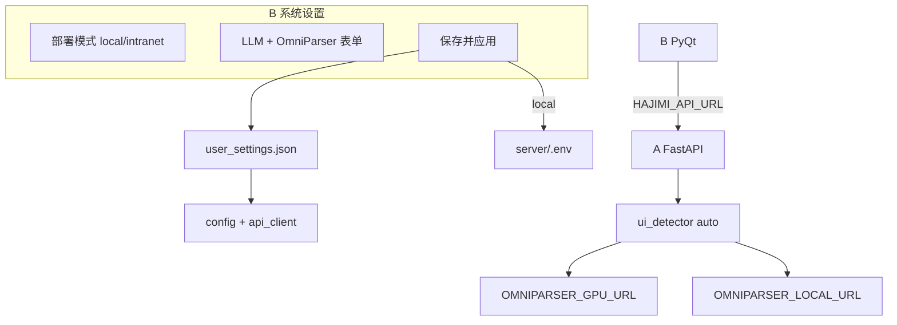

# HAJIMI 实训 DAY3 工作内容（v2）

> **日期**：实训第 3 天（对照 [`设计文档V2.md`](../设计文档V2.md)「核心开发 3–5 天」）  
> **角色**：B 端（前端 / 桌面应用）为主；A 端配合 GPU 容器部署  
> **成员分工依据**：设计文档 §九 — B 负责感知层 + 执行层（视觉）+ GUI  
> **文档版本**：v2 · 2026-07-01

---

## 一、DAY3 目标

| 路线阶段 | 天数 | DAY3 对应里程碑 |
|----------|------|-----------------|
| **核心开发** | 3–5 天 | 截图 → 解析 → SoM → LLM → 标注闭环稳定化 |
| **DAY3 专项** | 第 3 天 | **GPU/本地模型自动兼容** + **系统设置 UI** + **内网 API 部署模式** |

**DAY3 核心目标**：

1. B 端可在「本地启动 / 内网 API」间切换，配置持久化并立即生效  
2. A 端 `DETECTOR_BACKEND=auto` 自动探测 GPU → 本地 CPU → Replicate  
3. A 端同学在 GPU 容器内可按 runbook 独立完成部署并与 B 联调  
4. Native 中等窗口水晶玻璃视觉统一；Resize 指示条与 OmniParser 本地路径可稳定启动  

---

## 二、DAY3 任务清单

### 2.1 B 端 — 系统设置与持久化

| # | 任务 | 涉及文件 | 状态 |
|---|------|----------|------|
| 1 | 用户设置 JSON 持久化（启动加载 + apply） | `core/user_settings.py` | ✅ |
| 2 | 本地模式合并写入 `server/.env` | `core/env_sync.py` | ✅ |
| 3 | `config.reload_from_env()` | `config.py` | ✅ |
| 4 | 最早 apply 用户设置 | `main.py` | ✅ |
| 5 | 部署模式 Card（本地 / 内网） | `ui/native/settings_widgets.py`, `medium_panel.py` | ✅ |
| 6 | 模型 API 表单（LLM + OmniParser） | `ui/native/medium_panel.py` | ✅ |
| 7 | 保存并应用 / Enter 提交 | `SettingsEnterFilter`, `main_widget._on_settings_saved` | ✅ |
| 8 | 内网模式隐藏本地启停按钮 | `medium_panel._apply_deployment_mode_ui` | ✅ |
| 9 | SettingsInput / SettingsRadio 样式 | `ui/native/theme.qss` | ✅ |

### 2.2 B 端 — API 预检与状态文案

| # | 任务 | 涉及文件 | 状态 |
|---|------|----------|------|
| 1 | 内网模式仅查远程 `/health` | `core/api_client.py` | ✅ |
| 2 | 本地/auto 模式检查 `omniparser_ready` | `core/api_client.py` | ✅ |
| 3 | 状态文案：内网 / GPU/cuda / CPU/cpu | `_format_connection_label()` | ✅ |
| 4 | 启动 health 刷新设置页状态 | `main_widget._run_startup_health_check` | ✅ |
| 5 | 启动服务前 `sync_server_env` | `main_widget._on_start_services` | ✅ |

### 2.3 A 端 — auto 检测链与 health 扩展

| # | 任务 | 涉及文件 | 状态 |
|---|------|----------|------|
| 1 | `DETECTOR_BACKEND=auto` 探测链 | `server/services/ui_detector.py` | ✅ |
| 2 | `OMNIPARSER_GPU_URL` 等新 env | `server/config.py`, `server/.env.example` | ✅ |
| 3 | health 扩展字段 | `server/models/schemas.py`, `server/routes/demo.py` | ✅ |
| 4 | OmniParser `/probe/` 返回 device | `OmniParser/.../omniparserserver.py` | ✅ |
| 5 | `start_omniparser.bat` 可选 CUDA | `scripts/start_omniparser.bat` | ✅ |

### 2.5 B 端 — 水晶玻璃、Resize 指示条与 OmniParser 路径

| # | 任务 | 涉及文件 | 状态 |
|---|------|----------|------|
| 1 | 共享水晶玻璃 QPainter（α=165、20px 圆角、QPainter 阴影） | `ui/native/crystal_glass.py` | ✅ |
| 2 | 壳层 paintEvent + 内容区 QSS 透明一体式 | `medium_panel.py`, `compact_bar.py`, `theme.qss` | ✅ |
| 3 | 按钮/NavItem 等 QSS **不修改** | — | ✅ |
| 4 | 8 方向 resize 逻辑 + 仅左右 idle/hover 指示条 | `ui/native/resize_grip.py`, `ui/main_widget.py` | ✅ |
| 5 | 移除顶部 `ResizeHandleBar` 高度拖拽条 | `ui/native/medium_panel.py` | ✅ |
| 6 | 设置页 content 驱动宽高 + 离开恢复 | `medium_panel.panel_resize_requested`, `main_widget._size_before_settings` | ✅ |
| 7 | OmniParser 迁回项目根 `OmniParser/` | 仓库目录 | ✅ |
| 8 | 统一路径解析 `resolve_omni_root.bat` | `scripts/resolve_omni_root.bat` | ✅ |
| 9 | `patch_omniparser.py` 与 bat 路径逻辑对齐 | `scripts/patch_omniparser.py` | ✅ |
| 10 | 启动脚本接入 resolve + export `OMNI_ROOT` | `scripts/start_omniparser.bat`, `setup_omniparser.bat` | ✅ |
| 11 | GPU 部署排除目录修正 | `scripts/gpu_group2_deploy.py` | ✅ |
| 12 | 技术说明文档 | `docs/Resize指示条与OmniParser路径-技术说明.md` | ✅ |

### 2.4 文档与契约（v2 批次）

| # | 交付物 | 路径 | 状态 |
|---|--------|------|------|
| 1 | B 端接口总结 v2 | `docs/B端接口总结-对A与对C_v2.md` | ✅ |
| 2 | B 端改动记录 v2 | `docs/CHANGELOG-B端_v2.md` | ✅ |
| 3 | A 端改动记录 v2 | `server/docs/CHANGELOG-A端_v2.md` | ✅ |
| 4 | 校园 GPU 速查 v2 | `docs/校园GPU与OmniParser环境速查_v2.md` | ✅ |
| 5 | A 端 GPU 部署 runbook v2 | `server/docs/A端-学校GPU部署与联调指南_v2.md` | ✅ |
| 6 | A 端 README v2 | `server/README_v2.md` | ✅ |
| 7 | Demo API 契约 v2（health 扩展） | `api-contract-demo_v2.yaml` | ✅ |
| 8 | Resize + OmniParser 路径技术说明 | `docs/Resize指示条与OmniParser路径-技术说明.md` | ✅ |
| 9 | DAY3 工作总结 | `docs/DAY3-工作内容_v2.md` | ✅ 本文档 |

---

## 三、接口文档变更摘要（v1 → v2）

### 3.1 `GET /api/demo/health` 新增字段

| 字段 | 类型 | 说明 |
|------|------|------|
| `detector_backend` | string | 配置值：`auto` / `local_omniparser` / `replicate_omniparser` |
| `detector_active` | string | 实际使用的后端 |
| `detector_device` | string | `cuda` / `cpu` / `cloud` |
| `omniparser_url` | string | 当前 OmniParser 基址 |
| `omniparser_ready` | boolean | `/probe/` 是否可达 |

详见 [`api-contract-demo_v2.yaml`](../api-contract-demo_v2.yaml) 与 [`B端接口总结-对A与对C_v2.md`](B端接口总结-对A与对C_v2.md) §3.3.4。

### 3.2 B 端新增配置面（非 HTTP 接口）

| 项 | 持久化路径 | 说明 |
|----|------------|------|
| 部署模式 | `%LOCALAPPDATA%/HAJIMI/user_settings.json` | `local` / `intranet` |
| A 端 URL / Demo Key | 同上 → `HAJIMI_API_URL` / `HAJIMI_DEMO_KEY` | 保存后立即 apply |
| LLM / OmniParser | 同上 → `server/.env`（本地模式） | `core/env_sync.py` |

### 3.3 A 端检测后端

| 值 | 行为 |
|----|------|
| `auto` | GPU URL → 本地 URL → Replicate（可选） |
| `local_omniparser` | 固定 `OMNIPARSER_LOCAL_URL` |
| `replicate_omniparser` | 云端 Replicate |

---

## 四、DAY3 验收标准

### 4.1 B 端 / 代码

1. 系统设置 →「内网 API」→ 填 A 端 URL → 保存 → 立即检测/提问走远程，无需本地 OmniParser  
2.「本地启动」→ 填 DeepSeek Key + OmniParser URL → 保存 → 启动服务后 process/inspect 正常  
3. 重启 B 端后设置仍生效（读 `user_settings.json`）  
4. 表单内按 Enter 等效「保存并应用」  
5. 设置页视觉与现有 Card / SetRow 风格一致  
6. 中等窗口：无上下/顶部 resize 指示条；左右 hover 与玻璃面板同色  
7. 设置页进入时窗口随内容撑开，离开后恢复原尺寸  
8. `scripts\start_omniparser.bat` 可正确解析 `OMNI_ROOT` 并启动（或提示 Already running）  

### 4.2 A 端 / GPU

6. 容器内 `/probe/` 返回 `device=cuda`  
7. `/api/demo/health` → `omniparser_ready=true`，`detector_device=cuda`  
8. B 端（校园网）health 可达；内网模式状态栏显示「A 端已连接 (内网) …」  

### 4.3 文档

9. [`A端-学校GPU部署与联调指南_v2.md`](../server/docs/A端-学校GPU部署与联调指南_v2.md) 含阶段 0–7 可勾选 TodoList  
10. 全部 v2 文档交叉引用正确（见 §五）  
11. [`Resize指示条与OmniParser路径-技术说明.md`](Resize指示条与OmniParser路径-技术说明.md) 覆盖 UI 指示条与本地 OmniParser 启动  

---

## 五、DAY3 交付物索引（v2 文档）

| 文档 | 路径 |
|------|------|
| DAY3 工作总结 | [`DAY3-工作内容_v2.md`](DAY3-工作内容_v2.md) |
| B 端接口总结 | [`B端接口总结-对A与对C_v2.md`](B端接口总结-对A与对C_v2.md) |
| B 端改动记录 | [`CHANGELOG-B端_v2.md`](CHANGELOG-B端_v2.md) |
| A 端改动记录 | [`server/docs/CHANGELOG-A端_v2.md`](../server/docs/CHANGELOG-A端_v2.md) |
| 校园 GPU 速查 | [`校园GPU与OmniParser环境速查_v2.md`](校园GPU与OmniParser环境速查_v2.md) |
| **B 端联调清单（group2）** | [`校园GPU-B端联调清单_v2.md`](校园GPU-B端联调清单_v2.md) |
| **A 端 GPU 部署详细指南（group2）** | [`server/docs/A端-GPU容器部署详细指南-group2_v2.md`](../server/docs/A端-GPU容器部署详细指南-group2_v2.md) |
| 组内凭据（私密） | 根目录 `校园gpu使用.md`（建议 gitignore） |
| A 端 GPU runbook | [`server/docs/A端-学校GPU部署与联调指南_v2.md`](../server/docs/A端-学校GPU部署与联调指南_v2.md) |
| A 端 README | [`server/README_v2.md`](../server/README_v2.md) |
| Demo API 契约 v2 | [`api-contract-demo_v2.yaml`](../api-contract-demo_v2.yaml) |
| **Resize + OmniParser 技术说明** | [`Resize指示条与OmniParser路径-技术说明.md`](Resize指示条与OmniParser路径-技术说明.md) |
| UI 设计 spec（含 glass/resize 索引） | [`design-spec.md`](design-spec.md) |

> v1 文档（`api-contract-demo.yaml`、未带 `_v2` 的历史 CHANGELOG 等）仍保留作对照；**联调以 v2 为准**。

---

## 六、架构示意（DAY3 完成后）



---

## 七、快速命令参考

```powershell
# B 端（设置已持久化，直接启动）
python main.py

# 本地模式：启动 OmniParser + A 端（或设置页按钮）
scripts\start_all.bat

# 查看 OmniParser 解析路径
cd scripts
call resolve_omni_root.bat
set OMNI

# health（含 v2 扩展字段）
curl http://127.0.0.1:8010/api/demo/health

# 联调脚本
python scripts\verify_integration.py
```

**内网 API 模式（B 端）**：

1. 系统设置 → 内网 API  
2. A 端地址 = A 同学交接表 URL  
3. 保存并应用 →「立即检测当前屏幕」  

**A 端 GPU 容器**：按 [`A端-学校GPU部署与联调指南_v2.md`](../server/docs/A端-学校GPU部署与联调指南_v2.md) 阶段 0–7 执行。

---

## 八、DAY3 工作日志模板（提交实训用）

```markdown
### 日期：____年__月__日（DAY3）

**今日完成**
- 系统设置 UI（部署模式 + API 配置）
- auto 检测链 / health 扩展字段
- 水晶玻璃背景 + 左右 Resize 指示条 + OmniParser 路径修复
- （A 端）GPU 容器部署进度

**遇到的问题与解决**
- OmniParser 曾被误放入 `docs/`，导致 `start_omniparser.bat` 找不到 server/weights → 迁回项目根并新增 `resolve_omni_root.bat` 自动回退 `E:\Tools\OmniParser`

**与 A / C 联调情况**
- A 端 health / detector_device：
- B 端内网 API 模式：

**明日计划（DAY4）**
- 

**截图/录屏**（可选）
- 系统设置页保存成功
- health JSON 含 cuda
- 中等窗口左右 resize hover 玻璃色指示条
```

---

## 九、DAY3 补充说明 — 水晶玻璃与 OmniParser 路径

> 详细实现见 [`Resize指示条与OmniParser路径-技术说明.md`](Resize指示条与OmniParser路径-技术说明.md)

### 9.1 UI：Resize 指示条

| 项 | 说明 |
|----|------|
| Idle | 面板左右内缘各 24px 竖线 |
| Hover | 玻璃色胶囊 `QColor(6,10,22,165)`，与 `crystal_glass.py` 一致 |
| 不显示 | 上下边 idle/hover 指示、顶部 `ResizeHandleBar` |
| 仍可用 | 8 方向拖拽缩放（含四角、上下边） |

### 9.2 OmniParser：`OMNI_ROOT` 解析顺序

1. 环境变量 `OMNI_ROOT`  
2. 项目根 `OmniParser/`（需 server **且** `weights/icon_detect/model.pt`）  
3. `E:\Tools\OmniParser`（server 存在）  
4. 兜底 `E:\Tools\OmniParser`  

典型本机：项目内仅有 clone、权重在 Tools → 自动选用 `E:\Tools\OmniParser`。

---

## 十、DAY4 计划（预览）

| 优先级 | 任务 | 说明 |
|--------|------|------|
| P0 | 内网 GPU 端到端联调 | A 容器 + B 内网模式人工验收 |
| P0 | 真实桌面截图框位置人工对齐 | GPU 延迟应明显低于 CPU |
| P1 | `/clarify` UI 接入 | 低置信度澄清对话 |
| P1 | `/step` 指纹校验与挂起 UI | 蓝图状态机完整体验 |
| P2 | C 端 ASR 信号接入控制栏 | 按 `b-c-api-contract.md` |

---

## 十一、参考文档

- DAY2 基线：[`DAY2-工作内容.md`](DAY2-工作内容.md)
- 团队分工：[`设计文档V2.md`](../设计文档V2.md) §九
- B 接口总结 v2：[`B端接口总结-对A与对C_v2.md`](B端接口总结-对A与对C_v2.md)
- Resize + OmniParser：[`Resize指示条与OmniParser路径-技术说明.md`](Resize指示条与OmniParser路径-技术说明.md)
