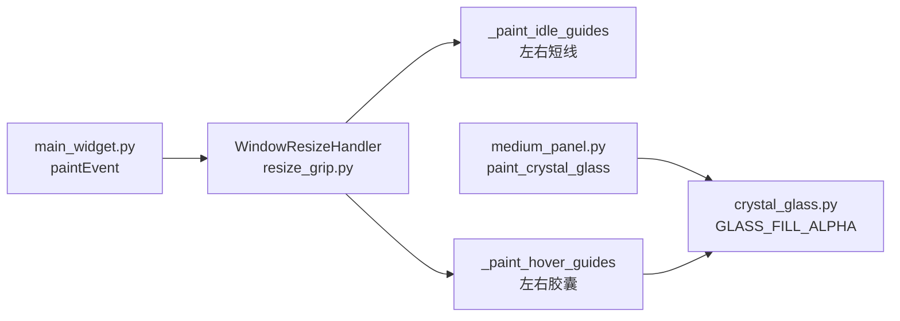
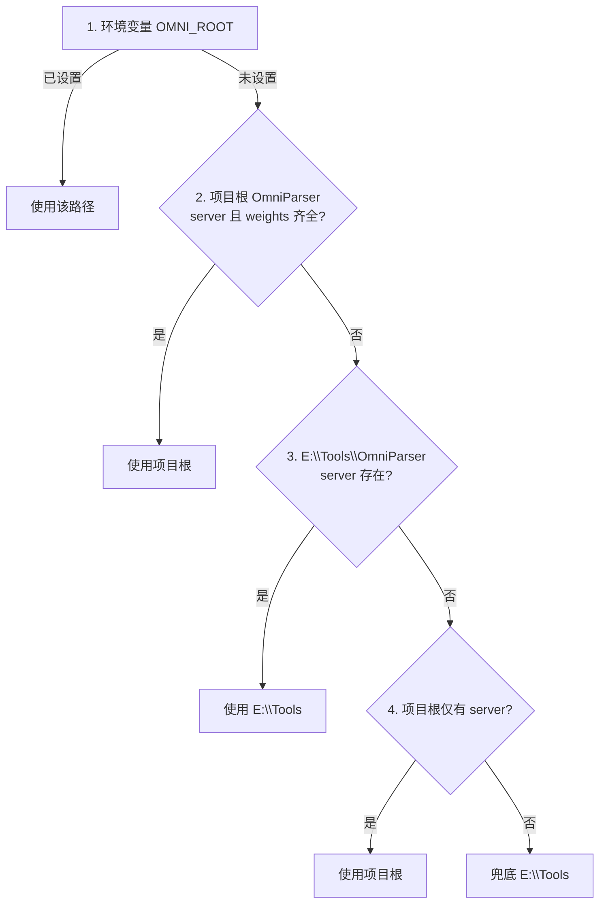

# Resize 指示条与 OmniParser 路径 — 技术说明

> **版本**：2026-06-30  
> **范围**：B 端 Native 中等窗口 resize 视觉指示条、水晶玻璃背景对齐、OmniParser 本地安装路径解析与启动脚本  
> **关联**：[design-spec.md](design-spec.md)、[校园GPU与OmniParser环境速查_v2.md](校园GPU与OmniParser环境速查_v2.md)、[OmniParser GPU 环境交接文档.md](OmniParser%20GPU%20环境交接文档.md)

---

## 一、概述

本次改动解决两类问题：

| 类别 | 问题 | 方案摘要 |
|------|------|----------|
| **UI** | 上下 resize 指示条；水晶玻璃一体式背景 | 仅左右 resize 指示；壳层 QPainter + 内容区 QSS 透明；按钮样式不改 |
| **OmniParser** | 代码树曾被误放入 `docs/OmniParser`，启动脚本找不到 server/weights | 迁回项目根 `OmniParser/`；统一 `resolve_omni_root` 解析逻辑 |

---

## 二、深色水晶玻璃一体式背景

### 2.0 原则（仅改背景，不改按钮）

- **绘制**：[`medium_panel.py`](../ui/native/medium_panel.py) / [`compact_bar.py`](../ui/native/compact_bar.py) 在 `paintEvent` 调用 [`paint_crystal_glass`](../ui/native/crystal_glass.py)；`WA_TranslucentBackground`；**不用** `QGraphicsDropShadowEffect`。
- **一体式**：[`theme.qss`](../ui/native/theme.qss) 中 `#NativeShell`、`#Card`、TopBar、滚动区等 **transparent**，透出同一水晶玻璃层。
- **例外（较高不透明度）**：聊天气泡 `bubble-*`、底部 `InputFloat`、悬浮 `DialogCard*`；侧栏打开时 `NavBackdrop` 变暗遮罩不变。
- **规范常量**：`GLASS_FILL_RGB = (6, 10, 22)`，`GLASS_FILL_ALPHA = 165`；边框白 α≈41；圆角 20px；对照 `python -m ui.glass_demo`。

---

## 三、Native Resize 指示条

### 3.1 设计目标

- **视觉**：中等模式（480×520 面板）仅在左右边缘显示细线 idle 指示；鼠标靠近左右边时显示与面板一致的玻璃色胶囊 hover 高亮。
- **交互**：仍支持 **8 方向**拖拽缩放（含四角、上下边），仅 **不绘制** 上下方向的指示条。
- **移除**：顶部 `ResizeHandleBar` 高度拖拽条及其 `height_resize_drag` 信号（设置页改由内容驱动宽高，见 §3.5）。

### 3.2 模块与调用链



| 文件 | 职责 |
|------|------|
| [`ui/native/resize_grip.py`](../ui/native/resize_grip.py) | `WindowResizeHandler`：边缘检测、拖拽缩放、指示条绘制 |
| [`ui/main_widget.py`](../ui/main_widget.py) | 在 `paintEvent` 末尾调用 `paint_resize_guides`；转发鼠标事件 |
| [`ui/native/medium_panel.py`](../ui/native/medium_panel.py) | 面板 `paintEvent` 绘制水晶玻璃；设置页发出 `panel_resize_requested` |
| [`ui/native/crystal_glass.py`](../ui/native/crystal_glass.py) | 共享玻璃绘制；`GLASS_FILL_ALPHA = 165` |

### 3.3 视觉常量

| 常量 | 值 | 含义 |
|------|-----|------|
| `GRIP` | 14 px | 边缘热区宽度（含四角） |
| `INSET` | 2 px | 指示条相对面板内缩 |
| `IDLE_SHORT` | 24 px | idle 竖线长度 |
| `IDLE_ALPHA` | 20 | idle 线 `rgba(255,255,255,0.08)` |
| `HOVER_THICK` | 3 px | hover 胶囊宽度 |
| `HOVER_STROKE_ALPHA` | 40 | hover 描边透明度 |
| `GLASS_FILL_ALPHA` | 165 | 与面板玻璃层一致：`QColor(6, 10, 22, 165)` |

**Idle 状态**：面板左右内缘各一条 24px 竖线，垂直居中。  
**Hover 状态**：左右各一圆角竖向胶囊（上下各留 `gap=22px`），填充与 `crystal_glass` 主填充相同。

### 3.4 交互逻辑

1. **`edge_at`**：根据鼠标在面板内的相对坐标判定 `l` / `r` / `t` / `b` / 四角。
2. **`try_move_global`**：hover 高亮仅映射到 `_lr_edge(edge)`（`l`/`r` 或对角映射到左/右），**上下边不触发 hover 绘制**。
3. **`try_press_global` / `_apply_resize`**：8 方向缩放逻辑保留；最小尺寸见 `MEDIUM_MIN_W` / `MEDIUM_MIN_H`；最大为屏幕可用区域的 90%。
4. **光标**：左右边为 `SizeHorCursor`；上下及四角仍为对应 resize 光标。

### 3.5 设置页尺寸联动（相关）

进入「系统设置」时，[`medium_panel.py`](../ui/native/medium_panel.py) 的 `_compute_settings_window_size()` 按内容 `sizeHint` + chrome 计算目标宽高，经 `panel_resize_requested` 通知 [`main_widget.py`](../ui/main_widget.py) 撑开窗口；离开设置时 `panel_restore_size` 恢复 `_size_before_settings`。此路径 **不再依赖** 顶部高度拖拽条。

### 3.6 调试与验收

| 检查项 | 预期 |
|--------|------|
| 中等窗口 idle | 仅左右各一条短竖线，无上下横线 |
| 鼠标贴左/右边 | 玻璃色竖向胶囊 + 半透明白描边 |
| 鼠标贴上/下边 | 无 hover 指示条，光标仍可变为垂直 resize |
| 拖拽四角/上下边 | 窗口可缩放 |
| 进入/离开设置 | 窗口随内容撑开并恢复原尺寸 |

本地对照 demo：`python -m ui.glass_demo`（仅玻璃绘制，不含 resize 指示条）。

---

## 四、OmniParser 路径与启动

### 4.1 背景

OmniParser 源码 **不应** 放在 `docs/` 下（该目录仅作文档与参考）。正确布局：

```
HAJIMI_UI/
├── OmniParser/                    # 项目内 clone（可无 weights）
│   ├── omnitool/omniparserserver/
│   ├── util/utils.py
│   └── weights/                   # 可选；缺失时回退 E:\Tools
├── scripts/
│   ├── resolve_omni_root.bat      # 统一路径解析
│   ├── start_omniparser.bat
│   ├── setup_omniparser.bat
│   └── patch_omniparser.py
└── E:\Tools\OmniParser\           # 本机常用完整安装（含 weights）
```

GPU 容器内路径独立为 `/workspace/code/OmniParser`，见 [A端-GPU容器部署详细指南-group2_v2.md](../server/docs/A端-GPU容器部署详细指南-group2_v2.md)。

### 4.2 路径解析优先级

[`scripts/resolve_omni_root.bat`](../scripts/resolve_omni_root.bat) 与 [`scripts/patch_omniparser.py`](../scripts/patch_omniparser.py) 中 `_resolve_omni_root()` **逻辑一致**：



**判定文件**：

- Server：`{OMNI_ROOT}/omnitool/omniparserserver/`
- Weights：`{OMNI_ROOT}/weights/icon_detect/model.pt`

典型本机场景：项目内仅有 clone、weights 在 `E:\Tools\OmniParser` → 自动选用 **E:\Tools\OmniParser**。

### 4.3 启动流程

[`scripts/start_omniparser.bat`](../scripts/start_omniparser.bat) 执行顺序：

1. `call resolve_omni_root.bat` → 设置 `OMNI_ROOT`
2. 探测 `http://127.0.0.1:8002/probe/` — 已运行则退出（避免重复启动）
3. 检查 server 目录、conda 环境 `omni`、`model.pt`
4. `set "OMNI_ROOT=%OMNI_ROOT%"` 后运行 `patch_omniparser.py`（空屏 `/parse/` 500 修复）
5. `check_port.py` 确认端口可用
6. 自动检测 CUDA，启动 `omniparserserver`（默认 CPU；有 GPU 则用 `cuda`）

一键全栈：`scripts\start_all.bat`（先 `stop_all`，再 OmniParser + A 端 + B 端）。

首次安装：`scripts\setup_omniparser.bat`（clone、conda、pip、ModelScope 下载 weights）。

### 4.4 环境变量

| 变量 | 默认 | 说明 |
|------|------|------|
| `OMNI_ROOT` | （自动解析） | 强制指定 OmniParser 根目录 |
| `OMNI_PORT` | `8002` | 服务端口 |
| `OMNI_PY` | `%CONDA_PREFIX%\envs\omni\python.exe` | Python 解释器 |
| `OMNIPARSER_MAX_SIDE` | `960` | 推理最长边 |
| `OMNIPARSER_BATCH_SIZE` | `8` | batch 大小 |

### 4.5 patch 说明

[`patch_omniparser.py`](../scripts/patch_omniparser.py) 修改 `{OMNI_ROOT}/util/utils.py`：

- `int_box_area`：空 box 安全返回 0
- `get_som_labeled_img`：无检测框时返回空标注图，避免 HTTP 500

标记字符串：`# HAJIMI_PATCH_EMPTY_SOM`。重复运行会跳过已 patch 文件。

### 4.6 常见问题

| 现象 | 原因 | 处理 |
|------|------|------|
| `[ERROR] OmniParser server dir not found` | 未 clone 或 `OMNI_ROOT` 错误 | 运行 `setup_omniparser.bat` 或设置 `OMNI_ROOT` |
| `[ERROR] Weights missing` | 当前 `OMNI_ROOT` 下无 `model.pt` | 在 Tools 目录下载 weights，或 `set OMNI_ROOT=E:\Tools\OmniParser` |
| patch 改错目录 | 单独运行 patch 时路径与 bat 不一致 | 已通过 `_resolve_omni_root()` 对齐；启动前 bat 会 export `OMNI_ROOT` |
| `Already running at ...` | 8002 上已有实例 | 正常；无需重复启动 |
| CPU 推理 2–4 分钟/帧 | 本机无可用 CUDA | 见 [校园GPU与OmniParser环境速查_v2.md](校园GPU与OmniParser环境速查_v2.md) 部署 GPU 或改用内网模式 |

**可选**：若希望权重也在项目内，可对 `OmniParser\weights` 建立 junction 指向 `E:\Tools\OmniParser\weights`，或重新运行 setup 下载到项目根。

### 4.7 验证命令

```bat
cd scripts
call resolve_omni_root.bat
set OMNI
python ..\scripts\patch_omniparser.py
scripts\start_omniparser.bat
```

另：`python scripts\diagnose_inspect.py` 检查 A 端与 OmniParser 探活。

---

## 五、部署脚本变更

[`scripts/gpu_group2_deploy.py`](../scripts/gpu_group2_deploy.py) 打包排除目录由 `docs/OmniParser` 改为 `OmniParser`（与项目根布局一致）。

---

## 六、关联文档索引

| 文档 | 内容 |
|------|------|
| [design-spec.md](design-spec.md) | Native UI token 与回退方式 |
| [校园GPU与OmniParser环境速查_v2.md](校园GPU与OmniParser环境速查_v2.md) | 学校 GPU、容器内 OmniParser |
| [OmniParser GPU 环境交接文档.md](OmniParser%20GPU%20环境交接文档.md) | A800 容器完整安装与 4 处源码修改 |
| [B端接口总结-对A与对C_v2.md](B端接口总结-对A与对C_v2.md) | 启动顺序、health、`omniparser_ready` |
| [CHANGELOG-B端_v2.md](CHANGELOG-B端_v2.md) | B 端改动时间线 |
