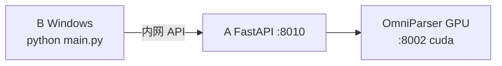

# 校园 GPU — B 端联调清单（v2 · group2）

> **读者**：B 端同学（Windows + PyQt 客户端）  
> **本组**：group2 @ `10.246.2.7`  
> **组内凭据**：[`校园gpu使用.md`](../校园gpu使用.md)（gitignore，含密码）  
> **A 端部署**：由 A 同学按 [`A端-GPU容器部署详细指南-group2_v2.md`](../server/docs/A端-GPU容器部署详细指南-group2_v2.md) 完成；**本组 A 端已部署**，可直接从 **§二「快速联调」** 开始。

---

## 组内文档索引

| 文件 | 用途 |
|------|------|
| [`校园gpu使用.md`](../校园gpu使用.md) | 凭据、接口 URL、交接表 |
| [`校园gpu使用.template.md`](校园gpu使用.template.md) | 无密码模板 |
| **本文档** | B 端操作步骤 |
| [`A端-GPU容器部署详细指南-group2_v2.md`](../server/docs/A端-GPU容器部署详细指南-group2_v2.md) | 发给 A 同学 |

---

## 职责划分

| 谁 | 做什么 |
|----|--------|
| **A 端** | 容器内 OmniParser `:8002` + FastAPI `:8010` + `server/.env` |
| **你（B 端）** | 校园网、SSH 隧道、系统设置「内网 API」、`python main.py` 验收 |



---

## 一、准备（一次性）

- [x] 连接校园网或 VPN，`ping 10.246.2.7` 通
- [x] 安装 MobaXterm 或 OpenSSH
- [x] 本机可运行 `python main.py`
- [x] 已把 A 端指南 + `校园gpu使用.md` 发给 A 同学
- [ ] 阅读 [`B端接口总结-对A与对C_v2.md`](B端接口总结-对A与对C_v2.md) §3.1–3.3（可选）

---

## 二、快速联调（本组已部署 · 每次使用前）

### 2.1 建立 SSH 隧道（必做）

**方式 A — 手动**（推荐日常开发，窗口保持打开）：

```powershell
ssh -L 8010:127.0.0.1:8010 student@10.246.2.7 -p 12202
```

密码见 [`校园gpu使用.md`](../校园gpu使用.md) §1。

**方式 B — 脚本**（自动写设置，隧道在脚本结束后会关闭，需配合方式 A 或重新运行）：

```powershell
cd E:\University\greed3-2\Shixun\HAJIMI_UI
python scripts/b_group2_intranet_setup.py
```

> **注意**：使用 `main.py` 期间隧道必须一直连着；断开后客户端会报「内网 A 端不可达」。

### 2.2 浏览器预检 health

打开：`http://127.0.0.1:8010/api/demo/health`

本组期望：

```json
{
  "status": "ok",
  "detector_backend": "auto",
  "detector_device": "cuda",
  "omniparser_ready": true
}
```

- [x] 脚本 `b_group2_e2e_verify.py` 已通过 health
- [ ] 本次会话浏览器 health 正常（每次联调前建议点一次）

### 2.3 配置 / 确认系统设置

1. `python main.py`
2. 打开 **系统设置** → **部署模式：内网 API**
3. 填写：

| 字段 | 本组值 |
|------|--------|
| A 端地址 | `http://127.0.0.1:8010` |
| Demo Key | `hajimi-demo-2026` |

4. **保存并应用**（或 Enter）

设置文件：`%LOCALAPPDATA%/HAJIMI/user_settings.json`  
脚本 `b_group2_intranet_setup.py` 可自动写入上述内容。

- [x] 内网 API 已保存
- [ ] 本次启动后状态栏显示「A 端已连接 (内网) …」或「GPU/cuda」

### 2.4 功能验收（真实桌面）

- [ ] **立即检测当前屏幕** → 青色 `~N` 框，GPU 约 **数秒～十几秒**
- [ ] 输入任务（如「怎么安装微信」）→ 步骤列表 + **红框**
- [ ] 无「请启动 OmniParser」类红色提示
- [ ] 开发者区无「启动 OmniParser + A 端」按钮（内网模式已隐藏）

### 2.5 自动化验收（可选）

```powershell
python scripts/b_group2_e2e_verify.py
```

通过表示 health + `verify_integration` 基线 OK（1×1 测试图 inspect/process 会 SKIP，属正常）。

---

## 三、A 端未完成时的流程（其他小组 / 重装参考）

若 A 端尚未部署，先等 A 同学完成并填写 [`校园gpu使用.md`](../校园gpu使用.md) §5 交接表，再执行 §二。

| 交接项 | 你需确认 |
|--------|----------|
| 网络方案 | A / B / C |
| A 端 Base URL | |
| Demo Key | |
| health 含 `detector_device=cuda` | |

---

## 四、HAJIMI 接口速查

Base = 系统设置中的 A 端地址（本组 `http://127.0.0.1:8010`）。

| 用途 | 方法 | 路径 | 认证 |
|------|------|------|------|
| 健康检查 | GET | `/api/demo/health` | 无 |
| 任务处理 | POST | `/api/demo/process` | `X-Demo-Key` |
| 屏幕检验 | POST | `/api/demo/inspect` | `X-Demo-Key` |
| 重新定位 | POST | `/api/demo/relocate` | `X-Demo-Key` |

实现：`core/api_client.py` · 契约：[`api-contract-demo_v2.yaml`](../api-contract-demo_v2.yaml)

---

## 五、常见问题

| 现象 | 处理 |
|------|------|
| 内网 A 端不可达 | 校园网/VPN；SSH 隧道是否关闭；URL 勿含 `/api/...` |
| health 浏览器 OK，客户端报错 | 重新「保存并应用」；核对 Demo Key |
| `401` | Demo Key 与 A 端 `HAJIMI_DEMO_KEY` 不一致 |
| `omniparser_ready=false` | 联系 A 重启 OmniParser（见 A 端指南 §7） |
| 检测很慢 | 看 health 是否 `detector_device=cuda` |
| 本地 8010 被占用 | 脚本会自动尝试 `18010`；或关闭占用进程 |

---

## 六、你不需要做

- Windows 安装 CUDA / OmniParser 权重  
- 内网模式下填写 OmniParser GPU URL（由 A 端容器处理）  
- 把密码提交 Git  

---

## 七、脚本与相关文档

```powershell
# 写内网设置 + 短暂隧道
python scripts/b_group2_intranet_setup.py

# 联调验收
python scripts/b_group2_e2e_verify.py

# 查远程 A/Omni 是否在跑（不建隧道）
python scripts/gpu_group2_remote.py services

# 远程重新部署 A（需 A 端配合）
python scripts/gpu_group2_deploy.py --all
```

| 文档 | 说明 |
|------|------|
| [`DAY3-工作内容_v2.md`](DAY3-工作内容_v2.md) | 系统设置 UI 说明 |
| [`B端接口总结-对A与对C_v2.md`](B端接口总结-对A与对C_v2.md) | 完整 HTTP 契约 |

---

## 八、本地 RTX 5070 / 50 系排障

**现象**：OmniParser 启动显示 `cuda mode`，`/parse/` 报 500，`no kernel image is available for execution on the device`。

**原因**：`setup_omniparser.bat` 默认安装 PyTorch **cu124**（最高 sm_90），RTX 5070 Ti 为 **sm_120**，`cuda.is_available()` 为 True 但无可用内核。

**处理**：

1. `Ctrl+C` 停 OmniParser，`scripts\stop_all.bat`
2. 重跑 `scripts\start_omniparser.bat`，确认终端显示 **`cpu mode`**
3. 或一键本地演示：`scripts\start_local_demo.bat`（强制 CPU）
4. **若要 GPU 加速**：优先 `python scripts/b_group2_intranet_setup.py` + 系统设置「内网 API」
5. **可选**本机 GPU：`scripts\upgrade_omni_pytorch_cu128.bat` 后重跑 start_omniparser

---

*文档版本：v2 · group2 · 2026-07-01*
