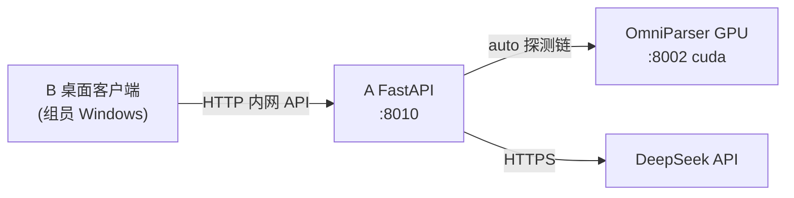

# A 端 — 学校 GPU 部署与联调指南（v2）

> **读者**：A 端负责人（在 GPU 容器内完成部署与运维）  
> **最后更新**：2026-07-01 · **文档版本**：v2  
> **关联文档**：[OmniParser GPU 环境交接文档.md](../../OmniParser%20GPU%20环境交接文档.md)、[校园GPU与OmniParser环境速查_v2.md](../../docs/校园GPU与OmniParser环境速查_v2.md)、[api-contract-demo_v2.yaml](../api-contract-demo_v2.yaml)、[CHANGELOG-A端_v2.md](CHANGELOG-A端_v2.md)

---

## 0. 配置完成后系统长什么样



| 层级 | 谁负责 | 跑在哪里 | 说明 |
|------|--------|----------|------|
| B 桌面客户端 | B 同学 | 组员 Windows | 系统设置选「**内网 API**」，填 A 端 URL + Demo Key |
| A FastAPI | **A 同学** | GPU 容器 `/workspace` | `server/`，`DETECTOR_BACKEND=auto` |
| OmniParser GPU | **A 同学** | 同容器 `:8002` | `--device cuda`，供 A 端 HTTP 调用 |
| DeepSeek LLM | **A 同学配置** | 云端 API | `server/.env` 中 `DEEPSEEK_API_KEY` |

**要点**：GPU 加速发生在容器内的 OmniParser；B 端只发 HTTP，不装 CUDA。

---

## 阶段 0：部署前准备（A 端 TodoList）

- [ ] 0.1 向指导教师领取：宿主机 IP、小组编号、SSH 端口/密码、Jupyter/VS Code Token（见操作手册 §1.2）
- [ ] 0.2 本机连接 **校园网或 VPN**，能 `ping` 通宿主机（如 `10.246.2.4`）
- [ ] 0.3 用 MobaXterm / Royal TSX SSH 登录：`ssh student@{IP} -p {1220N}`
- [ ] 0.4 SSH 内执行 `nvidia-smi`，确认 **1 张 GPU**、驱动 **535.x**、显存约 **80GB**
- [ ] 0.5 SSH 内执行 Python GPU 自检，期望 `CUDA available: True`
- [ ] 0.6 确认工作目录：`/workspace/code`、`/workspace/models` 可写
- [ ] 0.7 与 B 端对齐：**A 端对外端口**（建议 `8010`）、**Demo Key**（默认 `hajimi-demo-2026`）、是否需 SSH 隧道

---

## 阶段 1：拉取/同步 HAJIMI 代码（A 端 TodoList）

- [ ] 1.1 在容器内克隆或上传项目至 `/workspace/code/HAJIMI_UI`（与 B 端仓库一致分支）
- [ ] 1.2 确认子模块/目录：`server/`、`OmniParser/`（或单独 clone OmniParser 至 `/workspace/code/OmniParser`）
- [ ] 1.3 记录本组 **固定路径**（写入附录 A「本组环境记录表」）

---

## 阶段 2：OmniParser GPU 环境（A 端 TodoList）

> 细节见 [OmniParser GPU 环境交接文档.md](../../OmniParser%20GPU%20环境交接文档.md)，此处为检查点。

- [ ] 2.1 创建 venv：`/workspace/code/omniparser_api/.venv`，**Python 3.10.12**
- [ ] 2.2 配置 `HF_ENDPOINT=https://hf-mirror.com` 并写入 `~/.bashrc`
- [ ] 2.3 安装 **锁定版本** PyTorch `2.7.1+cu118`（上交镜像），**禁止 cu130**
- [ ] 2.4 安装 transformers `4.43.4`、paddleocr `2.8.1`、paddlepaddle-gpu `2.6.1` 等
- [ ] 2.5 下载权重至 `/workspace/models/`：OmniParser-v2.0、Florence-2-large
- [ ] 2.6 建立 `OmniParser/weights/` 软链接
- [ ] 2.7 完成 **4 处源码修改**（flash_attn、Florence-2、gradio_client、util/utils.py）
- [ ] 2.8 运行 `test_complete.py`，产出 `output_labeled.png` + `result.json`
- [ ] 2.9 启动 **GPU 版** omniparserserver：

```bash
cd /workspace/code/OmniParser/omnitool/omniparserserver
source /workspace/code/omniparser_api/.venv/bin/activate
python -m omniparserserver \
  --som_model_path ../../weights/icon_detect/model.pt \
  --caption_model_name florence2 \
  --caption_model_path ../../weights/icon_caption_florence \
  --device cuda \
  --host 127.0.0.1 \
  --port 8002
```

- [ ] 2.10 另开终端验证：`curl http://127.0.0.1:8002/probe/` — 期望含 `"device":"cuda"`
- [ ] 2.11 （推荐）用 `nohup`/`tmux` 保持 OmniParser 常驻
- [ ] 2.12 `nvidia-smi` 确认 parse 时 GPU 显存上升

---

## 阶段 3：A 端 FastAPI 部署（A 端 TodoList）

- [ ] 3.1 进入 `/workspace/code/HAJIMI_UI/server`，创建 venv：`python3 -m venv .venv && source .venv/bin/activate`
- [ ] 3.2 `pip install -r requirements.txt`（仅 server 依赖，勿与 OmniParser venv 混用）
- [ ] 3.3 复制并编辑 `server/.env`（容器专用模板见附录 B）：

```env
DEEPSEEK_API_KEY=sk-...
DEEPSEEK_BASE_URL=https://api.deepseek.com
DEEPSEEK_MODEL=deepseek-chat

DETECTOR_BACKEND=auto
OMNIPARSER_LOCAL_URL=http://127.0.0.1:8002
OMNIPARSER_GPU_URL=
OMNIPARSER_LOCAL_TIMEOUT=120
OMNIPARSER_PROBE_TIMEOUT=3

HAJIMI_DEMO_KEY=hajimi-demo-2026
HAJIMI_HOST=0.0.0.0
HAJIMI_PORT=8010
REQUIRE_IMAGE=true
ALLOW_DETECTOR_FALLBACK=false
```

- [ ] 3.4 说明：`OMNIPARSER_LOCAL_URL` 指向 **同容器内** GPU OmniParser；`auto` 模式下若填 `OMNIPARSER_GPU_URL` 则优先探测该 URL
- [ ] 3.5 启动 A 端（监听所有网卡以便 B 端内网访问）：

```bash
cd /workspace/code/HAJIMI_UI
source server/.venv/bin/activate
python -m uvicorn server.main:app --host 0.0.0.0 --port 8010
```

- [ ] 3.6 容器内自检：`curl http://127.0.0.1:8010/api/demo/health`
- [ ] 3.7 期望 health JSON 示例：

```json
{
  "status": "ok",
  "version": "1.0.0",
  "detector_backend": "auto",
  "detector_active": "local_omniparser",
  "detector_device": "cuda",
  "omniparser_url": "http://127.0.0.1:8002",
  "omniparser_ready": true
}
```

- [ ] 3.8 容器内 `/process` 冒烟：`python scripts/verify_integration.py` 或带 `X-Demo-Key` 的 curl
- [ ] 3.9 （推荐）A 端也 `nohup`/tmux 常驻，并写清日志路径

---

## 阶段 4：网络暴露与 B 端可达性（A 端 TodoList）

学校容器 **默认不** 把 `8010` 映射到宿主机公网端口，需与教师确认一种方案：

### 方案 A — 容器端口映射（若平台支持）

- [ ] 4.A.1 确认映射：容器 `8010` → 宿主机 `{某端口}`，记录 **B 端应填写的完整 URL**
- [ ] 4.A.2 组员 Windows（校园网）浏览器访问 `http://{宿主机IP}:{端口}/api/demo/health`

### 方案 B — SSH 隧道（B 端连 A 端）

- [ ] 4.B.1 A 端保证 `HAJIMI_HOST=0.0.0.0` 或 `127.0.0.1` + 隧道由 B 建立
- [ ] 4.B.2 B 端隧道命令模板：`ssh -L 8010:127.0.0.1:8010 student@{IP} -p {port}`
- [ ] 4.B.3 B 端系统设置填 `http://127.0.0.1:8010`

### 方案 C — 仅 VS Code Server 开发（A 自测，B 暂不接）

- [ ] 4.C.1 通过 VS Code 端口转发访问 health，先完成 A 端自验收

**本组最终选用方案**：________________（填写 A/B/C 及端口）

---

## 阶段 5：交付 B 端联调清单（A → B 交接）

| 交接项 | 示例 | 必填 |
|--------|------|------|
| A 端 Base URL | `http://10.246.2.4:8010` 或 `http://127.0.0.1:8010`（隧道） | 是 |
| Demo Key | `hajimi-demo-2026` | 是 |
| 部署模式 | B 端选「**内网 API**」 | 是 |
| health 是否正常 | 附 `curl` 截图或 JSON | 是 |
| `detector_device` | 期望 `cuda` | 是 |
| 单次 inspect 耗时 | 约 2–10s（GPU） | 建议 |
| OmniParser 是否常驻 | 是/否，重启命令 | 是 |
| A 端重启命令 | 见阶段 3.5 one-liner | 是 |
| 已知限制 | 如容器重建后需重新 `pip`/拉权重 | 建议 |

**B 端操作**（便于 A 验收联调）：

1. 系统设置 → **内网 API**
2. A 端地址 = 上表 URL；Demo Key = 上表 Key → **保存并应用**
3. 输入简单问题 + 截图流程，或 Settings「立即检测当前屏幕」
4. 期望：青色/红框坐标合理；不再提示「启动 OmniParser」

---

## 阶段 6：日常运维与排错（FAQ）

- [ ] 6.1 **重启顺序**：① OmniParser GPU → ② A FastAPI → ③ 通知 B 刷新 health
- [ ] 6.2 **显存占满**：`nvidia-smi` + `nvidia-smi pmon` 查 PID；避免多人重复起 omniparser
- [ ] 6.3 **502 DETECTOR_FAILED**：OmniParser 未启 / 端口错 / 上一次 parse 未结束
- [ ] 6.4 **422 NO_ELEMENTS**：空白桌面；换有 UI 的截图
- [ ] 6.5 **401 AUTH_FAILED**：B 端 Key 与 `HAJIMI_DEMO_KEY` 不一致
- [ ] 6.6 **CUDA False**：检查 PyTorch 是否误装 cu130；必须 cu118
- [ ] 6.7 **容器重建后**：`/workspace` 持久化内容仍在，但 venv 可能需重建
- [ ] 6.8 **禁止操作**：`sudo rm -rf`、改 NVIDIA 驱动、升级 transformers/paddleocr 大版本

---

## 阶段 7：A 端自验收 Checklist（全部打勾再叫 B 联调）

- [ ] 7.1 `nvidia-smi` 正常
- [ ] 7.2 OmniParser `/probe/` 返回 ready，`device=cuda`
- [ ] 7.3 A `/api/demo/health` → `omniparser_ready=true`，`detector_device=cuda`
- [ ] 7.4 `/api/demo/inspect` 真实桌面截图 → 200 + `ui_elements` 非空 + 延迟 < 30s
- [ ] 7.5 `/api/demo/process` 带图 + query → 200 + `steps` + `reference_resolution`
- [ ] 7.6 从 **B 同学电脑**（非容器内）访问 health 成功
- [ ] 7.7 填写 §5 交接表并同步群组

---

## 附录 A：本组环境记录表

| 项 | 值 |
|----|-----|
| 宿主机 IP | |
| 小组编号 | group__ |
| SSH 端口 | |
| A 端对外 URL | |
| Demo Key | |
| OmniParser 路径 | `/workspace/code/OmniParser` |
| A 端路径 | `/workspace/code/HAJIMI_UI` |
| 网络方案 | A / B / C |

---

## 附录 B：`server/.env` 容器完整模板

见阶段 3.3；完整示例见 [`server/.env.example`](../.env.example)。

---

## 附录 C：tmux 启动脚本示例

```bash
# OmniParser
tmux new -s omni -d 'cd /workspace/code/OmniParser/omnitool/omniparserserver && source /workspace/code/omniparser_api/.venv/bin/activate && python -m omniparserserver --som_model_path ../../weights/icon_detect/model.pt --caption_model_name florence2 --caption_model_path ../../weights/icon_caption_florence --device cuda --host 127.0.0.1 --port 8002'

# A 端
tmux new -s hajimi-a -d 'cd /workspace/code/HAJIMI_UI && source server/.venv/bin/activate && python -m uvicorn server.main:app --host 0.0.0.0 --port 8010'
```

---

## 附录 D：health 字段对照

| 字段 | 说明 |
|------|------|
| `detector_backend` | 配置值：`auto` / `local_omniparser` / `replicate_omniparser` |
| `detector_active` | 实际使用的后端 |
| `detector_device` | `cuda` / `cpu` / `cloud` |
| `omniparser_url` | 当前探测到的 OmniParser 基址 |
| `omniparser_ready` | `/probe/` 是否可达 |

详见 [CHANGELOG-A端_v2.md](CHANGELOG-A端_v2.md)。

---

## 附录 E：`auto` 检测链行为

当 `DETECTOR_BACKEND=auto`：

1. 探测 `OMNIPARSER_GPU_URL`（若配置，如 SSH 隧道到远程 GPU）
2. 探测 `OMNIPARSER_LOCAL_URL`（容器内 `:8002`）
3. 若均不可达且 `DETECTOR_AUTO_FALLBACK_REPLICATE=true` 且配置了 `REPLICATE_API_TOKEN`，回退 Replicate 云端

B 端「本地启动」模式保存设置时会将上述 URL 合并写入 `server/.env`。
